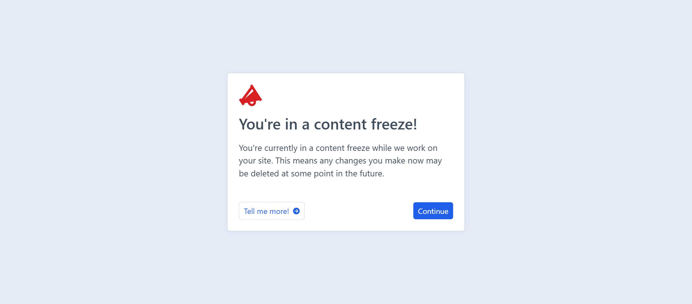

    

# Announce plugin for Craft CMS 4 and 5

Keep your clients and admin users informed with a simple announcement banner and login announcement modal.

## Features

### Announcement Banner

 - Display an announcement banner at the top of the admin panel.

 - You can add any text you like and optionally link to a URL for any purpose.

### Login Announcement Modal

 - Display an announcement modal when users log in to the admin panel.

 - The modal content is independant of the announcement banner and has an extra body text option.

 - The continue button text can be customized and redirect to any URL.

### Database Settings

The settings are not stored in the project config files, but in the database. This allows for easy configuration and updating of the settings per environment. The option to have the settings in the codebase is still available via a plugin config file.

## Requirements

This plugin requires Craft CMS 4.0.0 or later.

## Installation

You can install this plugin from the Plugin Store or with Composer.

#### From the Plugin Store

Go to the Plugin Store in your project’s Control Panel and search for “Announce”. Then press “Install”.

#### With Composer

Follow these steps to install Announce:

1. In your terminal, go to your Craft project:

        cd /path/to/your-project

2. Run the composer require command for the plugin:

        composer require honchoagency/craft-announce

3. Then, in the CLI, install the plugin using:

        ./craft plugin/install announce

    Alternatively, in the Control Panel, go to Settings → Plugins and click the “Install” button for Announce.

## Config file

You can create a `announce.php` file in your projects `config` directory to override the default settings.

Use the config file here to copy over and get you started:

[config.php](./src/config.php)

## Announce Roadmap

Current plans for the future of Announce include:

- **Multiple Announcements**: Allow for multiple announcements to be created and managed.

- **User Groups**: Allow for announcements to be targeted at specific user groups.

Created by [Honcho](https://honcho.agency)

